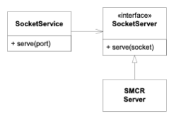
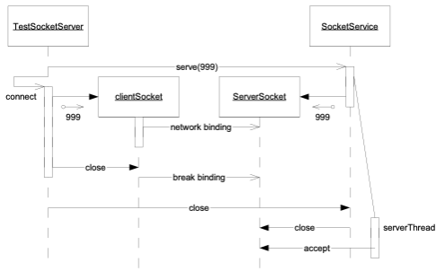

# The Craftsman: 6 SocketService 1

Robert C. Martin
16 Sept 2002

Yesterday left me drained. Jerry and I had solved the prime factors problem by sneaking up on it one tiny test case at a time. It was the strangest way to solve a problem that I have ever seen; but it worked better than my original solution.

I wandered aimlessly around the corridors thinking about it again and again. I don't remember dinner, or even being in the galley. I fell asleep early and dreamed of sequences of tiny test cases.

When I reported to Jerry this morning he said:

"Good Morning Alphonse. Are you ready to start working on a *real* project?"

"You bet I am!" Farb, yes, I was ready! I was tired of these play examples.

"Good! We've got a program called SMC that compiles a finite state machine grammar into Java. Mr. C. wants us to turn that program into a service delivered over the net."

"What do you mean?", I asked.

Jerry turned to a sketch-wall and began to talk and draw at the same time.


"We're going to write two programs. One called SMCR Client, and the other called SMCR Server. The user who wants to compile a finite state machine will invoke SMCR Client with the name of the file to be compiled. SMCR Client will send that file to a special computer where SMCR Server is running. SMCR Server will run the SMC compiler and then send the resulting compiled files back to SMCR Client. SMCR Client will then write them in the user's directory. As far as the user is concerned, it'll be no different than using SMC directly."

"OK, I think I understand." I said. "It sounds pretty simple."

"It is *pretty* simple." Jerry said. "But working with sockets is always just a little interesting."

So we sat down at a workstation and, as usual, got ready to write our first unit test. Jerry thought for a minute and then went back to the sketch-wall and drew the following diagram.



"Here's what I have in mind for SMCR Server." He said. "We'll put the socket management code in a class called `SocketService`. This class will catch, and manage, connections coming from the outside. When `serve(port)` is called, it'll create the service socket with the given port number and start accepting connections. Whenever a connection comes in it will create a new thread and pass control to the `serve(socket)` method of the `SocketServer` interface. That way we separate socket management code from the code that performs the services we desire."

Not knowing whether this was a good thing or not, I simply nodded. Clearly he had some reason for thinking the way he did. I just went along with it.

Next he wrote the following test.

```java
  public void testOneConnection() throws Exception {
    SocketService ss = new SocketService();
    ss.serve(999);
    connect(999);
    ss.close();
    assertEquals(1, ss.connections());
  }
```

"What I'm doing here is called *Intentional Programming*." Jerry said. I'm calling code that doesn't yet exist. As I do so, I express my intent about what that code should look like, and how it should behave."

"OK." I responded. "You create the `SocketService`. Then you ask it to accept connections on port 999. Next it looks like you are connecting to the service you just created on port 999. Finally you close the `SocketService` and assert that it got one connection."

"Right." Jerry confirmed.

"But how do you know `SocketService` will need the `connections` method?"

"Oh, it probably doesn't. I'm just putting it there so I can test it."

"Isn't that wasteful?" I queried?

Jerry looked me sternly in the eye and replied: "Nothing that makes a test easy is wasted, Alphonse. We often add methods to classes simply to make the classes easier to test."

I didn't like the `connections()` method, but I held my tongue for the moment.

We wrote just enough of the `SocketService` constructor, and the `serve`, `close`, and `connect` methods to get everything to compile. They were just empty functions. When we ran the test, it failed as expected.

Next Jerry wrote the `connect` method as part of the test case class.

```java
  private void connect(int port) {
    try {
      Socket s = new Socket("localhost", port);
      s.close();
    } catch (IOException e) {
      fail("could not connect");
    }
  }
```

Running this produced the following error:

```
  testOneConnection: could not connect
```

I said: "It's failing because it can't find port 999 anywhere, right?"

"Right!" said Jerry. "But that's easy to fix. Here, why don't you fix it?"

I'd never written socket code before, so I wasn't sure what to do next. Jerry pointed me to the `ServerSocket` entry in the Javadocs. The examples there made it look pretty simple. So I fleshed in the `SocketService` methods as shown below.

```java
import java.net.ServerSocket;

public class SocketService {
  private ServerSocket serverSocket = null;

  public void serve(int port) throws Exception {
    serverSocket = new ServerSocket(port);
  }

  public void close() throws Exception {
    serverSocket.close();
  }

  public int connections() {
    return 0;
  }
}
```

```
Running this gave us:  testOneConnection: expected:<1> but was:<0>
```

"Aha!" I said. "It found port 999. Cool! Now we just need to count the connection!"

So I changed the `SocketService` class as follows:

```java
import java.io.IOException;
import java.net.ServerSocket;
import java.net.Socket;

public class SocketService {
  private ServerSocket serverSocket = null;
  private int connections = 0;

  public void serve(int port) throws Exception {
    serverSocket = new ServerSocket(port);
    try {
      Socket s = serverSocket.accept();
      s.close();
      connections++;
    } catch (IOException e) {
    }
  }

  public void close() throws Exception {
    serverSocket.close();
  }

  public int connections() {
    return connections;
  }
}
```

But this didn't work. It didn't even fail. When I ran the test, the test hung.

"What's going on?" I asked.

Jerry smiled. "See if you can figure it out, Alphonse. Trace it through."

"OK, let's see. The test program calls `serve`, which creates the socket and calls `accept`. Oh! `accept` doesn't return until it gets a connection! And so `serve` never returns, and we never get to call `connect`."

Jerry nodded. "So how are you going to fix this Alphonse?"

I thought about this for a minute. I needed to call the `connect` function after calling `accept`, but when you call `accept`, it won't return until you call connect. At first this sounded impossible.

"It's not impossible, Alphonse." said Jerry. "You just have to create a thread."

I thought about this a little more. Yes, I could put the call to accept in a separate thread. Then I could invoke that thread and then call connect.

"I see what you mean about socket code being a little interesting." I said. And then I made the following changes.

```java
  private Thread serverThread = null;

  public void serve(int port) throws Exception {
    serverSocket = new ServerSocket(port);
    serverThread = new Thread(
      new Runnable() {
        public void run() {
          try {
            Socket s = serverSocket.accept();
            s.close();
            connections++;
          } catch (IOException e) {
          }
        }
      }
    );
    serverThread.start();
  }
```

"Nice use of the anonymous inner class, Alphonse." said Jerry.

"Thanks." It felt good to get a compliment from him. "But it does make for a lot of monkey tails at the end of the function."

"We'll refactor that later. First, lets run the test."

The test ran just fine, but Jerry looked pensive, like he'd just been lied to.

"Run the test again, Alphonse."

I happily hit the run button, and it worked again.

"Again." he said.

I looked at him for a second to see if he was joking. Clearly he was not. His eyes were locked on the screen, as though he were hunting a dribin. So I hit the button again and saw:

```
	testOneConnection: expected:<1> but was:<0>
```

"Now wait a minute!" I hollered. "That can't be!"

"Oh, yes it can." Jerry said. "I was expecting it."

I repeatedly pushed the button. In ten attempts I saw three failures. Was I losing my mind? How can a program behave like that?

"How did you know, Jerry? Are you related to the oracle of Aldebran?"

"No, I've just written this kind of code before, and I know a little bit about what to expect. Can you work out what's happening? Think it through carefully."

My brain was already hurting, but I started piecing things together. I went to the sketch-wall and began to draw.



When I had worked it out, I recited the scenario to Jerry. "`TestSocketServer` sent the `serve(999)` message to `SocketService`. `SocketService` created the `ServerSocket` and the `serverThread` and then returned. `TestSocketServer` then called `connect` which created the client socket. The two sockets must have found each other because we didn't get a '`could not connect`' error. The `ServerSocket` must have accepted the connection, but perhaps `serverThread` hadn't had a chance to run yet. And while `serverThread` was blocked, the `connect` function closed the client socket. Then `TestSocketServer` sent the close message to the `SocketService`, which closed the `serverSocket`. By the time the `serverThread` got a chance to call the `accept` function, the server socket was closed."

"I think you're right." Jerry said. "The two events - accept and close - are asynchronous, and the system is sensitive to their order. We call that a *race condition*. We have to make sure we always win the race.

We decided to test my hypothesis by putting a print statement in the catch block after the `accept` call. Sure enough, three times in ten, we saw the message.

"So how can we get our unit test to run?" Jerry asked me.

"It seems to me that the test can't just open the client socket and then immediately close it." I replied. "It needs to wait for the accept."

"We could just wait for 100ms real time before closing the client socket." he said.

"Yeah, that would probably work." I replied. "But it's a bit ugly."

"Let's see if we can get it to work, and then we'll consider refactoring it."

So I made the following changes to the `connect` method.

```java
 private void connect(int port) {
    try {
      Socket s = new Socket("localhost", port);
      try {
        Thread.sleep(100);
      } catch (InterruptedException e) {
      }
      s.close();
    } catch (IOException e) {
      fail("could not connect");
    }
  }
```

This made the tests pass 10 for 10.

"This is scary." I said. "The fact that a test passes once doesn't mean the code is working."

"Yeah." Jerry agreed. "When you are dealing with multiple threads, you have to keep an eye out for possible race conditions. Hitting the test button multiple times is a good habit to get into."

"It's a good thing we found this in our test cases." I said. "Finding it after the system was running would have been a *lot* harder."

Jerry just nodded.
