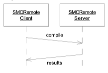

# The Craftsman: 14 SMCRemote Part IV Transactions

Robert C. Martin
19 May, 2003

*...Continued from last month. See > for last month's article, and the code we were working on. You can download that code from:*

*[Craftsman_14_SMCRemote_IV_Transactions.zip](archive/Craftsman_14_SMCRemote_IV_Transactions.zip)*

"OK Hotshot, let's see what you've got."

The intensity of Jasmine's stare nailed me to my chair. "W-What do you mean?" I stammered.

"Look, Hotshot, you aren't going to embarrass *me* the way you did Jerry. I mean Jerry's good and all, but I'm a *lot* better."

"I wasn't trying to embarrass anyone, I..."

"Yah, sure. Let's just get on with this, shall we? What's the next change you expect to make?"

We were sitting in the lab, looking at the code that Jerry and I had just written. I had showed Jasmine how I had changed Jerry's code that sent strings across the socket to send objects instead.

"I -- er -- I don't know. I just thought sending objects would be --uh -- better than strings." God, she made me nervous. She is stunningly beautiful, in an austere kind of way. Intensity spills out of her every look and action. And those deep black eyes!

Jasmine rolled those eyes now. "THINK! Hotshot, THINK! You aren't just going to wrap a couple of strings and integers into an object are you? What does that wrapping imply? What can you *do* with it?"

"I, uh..." If she'd stop pinning me with those eyes I might be able to THINK. I simultaneously wanted to be anywhere else, and nowhere else. It felt like being torn in two.

I closed my eyes and mentally recited a quick calming mantra. I forced the tension out of my mind and body. Within a few seconds I was able to consider the question she had provoked me with.

The test case we were working on verified that we could send a file over the socket. The code that sent the file looked like this:

```java
    private void writeSendFileCommand() throws IOException {
        os.writeObject("Sending");
        os.writeObject(itsFilename);
        os.writeLong(itsFileLength);
        char buffer[] = new char[(int) itsFileLength];
        fileReader.read(buffer);
        os.writeObject(buffer);
        os.flush();
    }
```

But *why* were we sending a file? We were sending it to the SMCRemoteServer to be compiled. Then the server would send back the compiled file. Why had Jerry sent the "Sending" string first? He said that it was to alert the server that a file was coming. But we don't want to tell the server that a file is coming, we want to tell the server to compile a file, and send back the results.

I was thinking hard, but some part of my brain continued to recite the calming mantra. Almost as if in a trance, I walked to the wall and drew the following diagram:



I looked over at Jasmine, and noticed a smile flicker across her severe expression. "I like the way you are thinking Hotshot, but don't stop there."

There were four pieces of data being sent to the server. The file name, the file length, the file contents, and the "Sending" string. Why were these being sent separately? They were all part of the same packet of information, the same -- Transaction! That was it!

I shook myself out of my calming trance and made the following change to the test:

```java
  public void testCompileFile() throws Exception {
    File f = createTestFile("testSendFile", "I am sending this file.");
    c.setFilename("testSendFile");
    assertTrue(c.connect());
    assertTrue(c.prepareFile());
    assertTrue(c.compileFile());
    Thread.sleep(50);
    assertTrue(server.fileReceived);
    assertEquals("testSendFile", server.filename);
    assertEquals(23, server.fileLength);
    assertEquals("I am sending this file.", new String(server.content));
    f.delete();
  }
```

Then I modified the old sendFile function as follows:

```java
  public boolean compileFile() {
    boolean fileSent = false;
    char buffer[] = new char[(int) itsFileLength];
    try {
      fileReader.read(buffer);
      CompileFileTransaction cft =
        new CompileFileTransaction(itsFilename, buffer);
      os.writeObject(cft);
      os.flush();
      fileSent = true;
    } catch (Exception e) {
      fileSent = false;
    }
    return fileSent;
  }
```

I looked over at Jasmine, and saw that she was following along *very* closely. I couldn't read her expression through her raw intensity, but I was pretty sure I was on a good track.

Next I wrote the CompileFileTransaction class.

```java
public class CompileFileTransaction implements Serializable {
  private String filename;
  private char contents[];
  public CompileFileTransaction(String filename, char buffer[]) {
    this.filename = filename;
    this.contents=buffer;

  }
  public String getFilename() {
    return filename;
  }
  public char[] getContents() {
    return contents;
  }
}
```

This allowed the project to compile. Of course the tests failed big time. So I made the following changes to the mock server in the test.

```java
  public void serve(Socket socket) {
    try {
      os = new PrintStream(socket.getOutputStream());
      is = new ObjectInputStream(socket.getInputStream());
      os.println("SMCR Test Server");
      os.flush();
      parse(is.readObject());
    } catch (Exception e) {
    }
  }

  private void parse(Object cmd) throws Exception {
    if (cmd != null) {
      if (cmd instanceof CompileFileTransaction) {
        CompileFileTransaction cft = (CompileFileTransaction) cmd;
        filename = cft.getFilename();
        content = cft.getContents();
        fileLength = content.length;
        fileReceived = true;
      }
    }
  }
```

These changes made all the tests pass. I looked over at Jasmine and asked: "Is this what you had in mind?"

"Well, Hotshot, it's a start. It's certainly a lot better than converting all the data elements to strings the way Jerry did it. And it's also a lot better than shipping each data element as its own individual object."

"How would you make it better?" I asked, hoping to get her focus off me, and onto the project.

"Later." she said. "Right now, let's complete the transaction. You've got to get the client to accept server's response."

"That shouldn't be hard." I said. So I added the following three lines to the end of the testCompileFile test case:

```java
    File resultFile = new File("resultFile.java");
    assertTrue("Result file does not exist", resultFile.exists());
    resultFile.delete();
```

I ran the test and verified that it failed.

"After we call compileFile the results should be written into a file." I explained to Jasmine. "At the moment I don't care what's in that file I just want to make sure that it gets created."

"So how are you going to create it?" she challenged.

"I'll show you." I said, and I made the following change to the mock server in the test.

```java
  private void parse(Object cmd) throws Exception {
    if (cmd != null) {
      if (cmd instanceof CompileFileTransaction) {
        CompileFileTransaction cft = (CompileFileTransaction) cmd;
        filename = cft.getFilename();
        content = cft.getContents();
        fileLength = content.length;
        fileReceived = true;
        CompilerResultsTransaction crt =
          new CompilerResultsTransaction("resultFile.java");
        os.writeObject(crt);
        os.flush();
      }
    }
  }
```

Then I made this compile by creating a skeleton of the CompilerResultsTransaction class.

```
public class CompilerResultsTransaction implements Serializable {
  public CompilerResultsTransaction(String filename) {

  }

  public void write() {

  }
}
```

Of course the test still failed. So I made the following change to compileFile.

```java
  public boolean compileFile() {
    boolean fileCompiled = false;
    char buffer[] = new char[(int) itsFileLength];
    try {
      fileReader.read(buffer);
      CompileFileTransaction cft =
        new CompileFileTransaction(itsFilename, buffer);
      os.writeObject(cft);
      os.flush();
      Object response = is.readObject();
      CompilerResultsTransaction crt = (CompilerResultsTransaction)response;
      crt.write();
      fileCompiled = true;
    } catch (Exception e) {
      fileCompiled = false;
    }
    return fileCompiled;
  }
```

And then finally I fleshed out the transaction.

```java
public class CompilerResultsTransaction implements Serializable {
  private String filename;
  public CompilerResultsTransaction(String filename) {
    this.filename = filename;
  }

  public void write() throws Exception {
    File resultFile = new File(filename);
    resultFile.createNewFile();
  }
}
```

"Good enough for now." Jasmine said, and leaned back in her chair. "I'm going to go on break in a few minutes while you get the CompilerResultsTransaction to actually write the file instead of just create it. Also, I'd like you to do a bit of cleanup of the code. There's a lot of cruft left behind from when you and Jerry were messing around with sending strings and integers. But before I go, I'd like your thoughts on that instanceof you used in the mock server."

"That was the simplest thing I could think of to check whether or not the incoming object was a CompileFileTransaction." I said. "Is there something wrong with it?"

She stood up, preparing to leave. She looked down at me and said: "No, nothing horribly wrong. But do you think that's what the real server is going to do? Do you think the real server will have a long if/else chain of instanceof expressions to parse the incoming transactions?"

"I hadn't really thought that far ahead." I said.

"No." she said flatly. "I imagine you hadn't." And she strode out of the room.

The room felt distinctly empty without her in it, as though my presence didn't count at all. I let out a long sigh, and shook my head. I could see that the working with Jasmine was going to be both exhausting and educational in many different ways.

One thing I was sure of, I *really* hated being called Hotshot. I sighed again, turned back to the computer, and started working on the tasks he gave me.

*To be continued.*

*The code that Jerry and Alphonse finished can be retrieved from:*

*[Craftsman_13_SMCRemote_III_Objects.zip](archive/Craftsman_13_SMCRemote_III_Objects.zip)*
