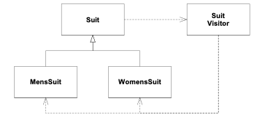

# The Craftsman: 45 Brown Bag II Java Generics 2

Robert C. Martin
6 December 2005

*...Continued from last month.*

*July, 1944.*

*Werner Von Braun tipped his head back and gave a loud belly-laugh. It was just dumb luck that the paper written by Stanislaw Ulam, a member of the contingent, and part of project Nimbus, had crossed his desk. It wasn't a paper about rockets or anything related to rocketry. Indeed, Ulam proposed that instead of using expensive and unreliable rockets to propel an intercontinental missile to it's target, you could drop tiny atomic bombs out the back end and blow them up behind a protective pusher plate. Von Braun laughed and laughed, because he realized that Ulam was thinking far too small.*

*Tuesday, 26 Feb 2002, 1100*

Avery walked into the conference room just after me. He had a cocky look on his face, so I knew he had something good for me.

"OK, Alphonse", he began, "Suppose you must print an inspection report for each spacesuit in the inventory. The report contains a line for each suit. Men's suits have three inspection points labeled A, B, and C, whereas women's suits have two, A and B. A typical report might look like this:" And he showed me an index card with the following.

```
314159 MS A:3, B:4, C:2
749445 WS A:2, B:6
```

"This report describes two suits" he went on. "The first is a men's suit, and the second is a woman's suit, as shown by the MS and WS. The values of each inspection point is printed following it's name." Avery stopped and looked at me expectantly.

"OK", I said, "That's clear. So what's your point?"

"How would you design the program that prints this report?"

"I'll show you." I said, and I began to type.

```java
public class SuitInspectionReport {
  public String generate(SuitInventory inventory) {
    StringBuffer report = new StringBuffer();
    for (Suit s : inventory.getSuits()) {
      report.append(s.getInspectionReportLine()).append("\n");
    }
    return report.toString();
  }
}
public abstract class Suit {
  protected int barcode;

  public Suit(int barcode) {
    ...
  }

  public abstract String getInspectionReportLine();
}
public class MensSuit extends Suit {
  private int ipa;
  private int ipb;
  private int ipc;

  public MensSuit(int barCode) {
    super(barCode);
  }

  public String getInspectionReportLine() {
    return String.format("%d MS A:%d, B:%d, C:%d",
                         barcode, ipa, ipb, ipc);
  }
}
public class WomensSuit extends Suit {
  private int ipa;
  private int ipb;
  public WomensSuit(int barCode) {
    super(barCode);
  }

  public String getInspectionReportLine() {
    return String.format("%d WS A:%d, B:%d",
                         barcode, ipa, ipb);
  }
}
```

"Very good!" said Avery. "I thought you might do something like that. But don't you think something smells about that design?"

"You mean the short variable names?"

"No, I mean something about the structure."

I looked the code over, but didn't see anything wrong with it. So I shrugged and looked at Avery expectantly.

Avery signed and said: "Think about design principles, Alphonse."

"Oh, right! SRP!"

Avery gave me a condescending smile and said: "Yeah, right!" He was enjoying this. "The Single Responsibility Principle says that you shouldn't put code that changes for different reasons into the same class."

"Right, right." I said, trying to get ahead of Avery. "The report format is going to change for different reasons than the rest of the code in the `Suit` derivatives."

"Right, the `Suit` derivatives will contain business rules for managing suits, and should not be coupled to something as transient as report formats. And another thing: what if there are a dozen different kinds of reports for suits? Do we really want a dozen `getXXXReportLine` methods in `Suit`?"

"OK, you got me. OCP is violated too."

"Bingo, Alphonse. The Open Closed Principle implies that you shouldn't set up a class so that it will require continuous modification. Every time there is a new kind of report, the `Suit` classes will have to be changed."

I sighed and said: "OK, Avery, you've made your point. The `getInspectionReportLine` method doesn't belong in `Suit`. That's a shame since it was so nicely polymorphic."

"Yeah, but it with two major principle violations..."

"Yeah. So what do we do about it?"

Avery smiled and said: "You were right when you said that the `getInspectionReportLine` method was nicely polymorphic. If possible we'd like to preserve that polymorphism, but remove the method from the `Suit` hierarchy. It turns out that there is a simple way to add polymorphic methods to hierarchies without modifying those hierarchies."

"OK, you've got my interest. How do you add polymorphic methods to a hierarchy, without modifying that hierarchy?"

"Watch this." Avery said with a smirk. And he began to type.

```java
public abstract class Suit {
  protected int barcode;

  public Suit(int barcode) {
    this.barcode = barcode;
  }

  public abstract void accept(SuitVisitor v);
}
public interface SuitVisitor {
  public void visit(MensSuit ms);
  public void visit(WomensSuit ws);
}
public class MensSuit extends Suit {
  int ipa;
  int ipb;
  int ipc;

  public MensSuit(int barCode) {
    super(barCode);
  }

  public void accept(SuitVisitor v) {
    v.visit(this);
  }
}
public class WomensSuit extends Suit {
  int ipa;
  int ipb;

  public WomensSuit(int barCode) {
    super(barCode);
  }

  public void accept(SuitVisitor v) {
    v.visit(this);
  }
}
public class SuitInspectionReportVisitor implements SuitVisitor {
  public String line;

  public void visit(MensSuit ms) {
    line = String.format("%d MS A:%d, B:%d, C:%d",
                         ms.barcode, ms.ipa, ms.ipb, ms.ipc);
  }

  public void visit(WomensSuit ws) {
    line = String.format("%d WS A:%d, B:%d",
                         ws.barcode, ws.ipa, ws.ipb);
  }
}
public class SuitInspectionReport {
  public String generate(SuitInventory inventory) {
    StringBuffer report = new StringBuffer();
    SuitInspectionReportVisitor v = new SuitInspectionReportVisitor();
    for (Suit s : inventory.getSuits()) {
      s.accept(v);
      report.append(v.line).append("\n");
    }
    return report.toString();
  }
}
```

This was a lot to take in. I had to read the code over several times because at first it was hard to see what was going on. Eventually, though, it became clear. The `accept` method knows which derivative of `Suit` it is running in, and so it knows which `visit` method to call. Simple, once you know the trick.

Then I took a closer look. All the dependencies were right. `SuitInspectionReport` had no idea what type of `Suits` it was dealing with. The `Suit` derivatives were completely decoupled from the report format. Indeed, I could add any new report I wanted simply by creating a new derivative of `SuitVisitor`. This really was like adding a new polymorphic method to the `Suit` hierarchy; without having to change the `Suits` at all!

"That's really cool, Avery!" I said appreciatively. "Where did you learn that trick?"

"Have you heard of John Vlissides?" Avery asked?

"Of course, who hasn't?"

"Right. I attended a talk he gave a few weeks ago. This was one of the techniques he talked about. He called it the *Visitor* pattern."

"Wow, how did I miss a talk by Vlissides? You should have told me!"

"I didn't know you then. Besides it was a private talk for my graduating class."

"Well, I envy you. He's a great speaker. So, he called this the Visitor pattern eh? I wonder why?"

"I don't know. The name doesn't seem to make a lot of sense to me."

"Regardless of the name, it sure looks like a useful technique. I love the way it manages the dependencies in this situation. The report logic is so nicely decoupled from the `Suit` hierarchy."

Avery paused for a second and then said: "It's a good technique, but it's not perfect. There is a nasty dependency cycle at it's heart."

"A dependency cycle?"

"Yeah. `Suit` depends upon `SuitVisitor`, which depends upon both derivatives of `Suit`. And of course the derivatives of `Suit` depend upon `Suit`." Avery drew a little picture on his sketch pad while he talked.



I looked at this diagram for a few seconds and then said: "OK, I see the cycle. What I don't see is why the cycle is a problem."

"Do you agree that its a general rule of OO that base classes should not depend upon their derivatives?"

"Sure, everyone knows that!"

"OK, so at very least `Suit` *transitively* depends upon its own derivatives."

"Sure, I see that. But what does that harm?"

"For one thing, it confuses build order. Imagine you are the Java compiler. You have been told to build `Suit`. Suppose this is a clean compile, so there are no `.class` files around from previous compiles. As you begin to compile `Suit` you see a reference to `SuitVisitor`, so you decide to compile `SuitVisitor` before you finish compiling `Suit`. But as you compile `SuitVisitor` you see references to `MensSuit` and `WomensSuit`, so you decide to compile them first. But as you compile them you see references to `Suit`, which you are trying to compile. What do you do?"

I thought about this for several seconds and realized that there was no way out. "I see, so there is no correct order to build these classes. No matter what order you build them in, the order must be wrong."

"Exactly! Now in cases like `SuitVisitor`, build order isn't very important since the classes are simple enough for the compiler to get right despite the ambiguous build order. But in more complicated cases, cycles of dependencies can cause some really nasty problems. The symptom of these problems is that you have to build the system more than once before it works. The first time you build it, the build order is wrong, and something breaks at runtime. The second, or third, or fourth time you build it, without deleting the class files in between builds, you finally, accidentally, get the order right enough to run."

"That's kind of scary."

"Yes, it is. You have to be very careful with dependency cycles in Java, and make sure you eliminate all but the most trivial."

"OK, but the `SuitVisitor` cycle isn't harmful."

"I didn't say that. All I said was that the ambiguous build order wasn't harmful. There are other reasons to avoid such cycles."

"Whew! It's time to get back to work; but let's talk more about this tomorrow."

This article is dedicated to the memory of John Vlissides, co-author of *Design Patterns* and trusted friend and colleague.

*To be continued...*

http://www.objectmentor.com/resources/articles/srp

http://www.objectmentor.com/resources/articles/ocp

http://www.objectmentor.com/resources/articles/visitor
